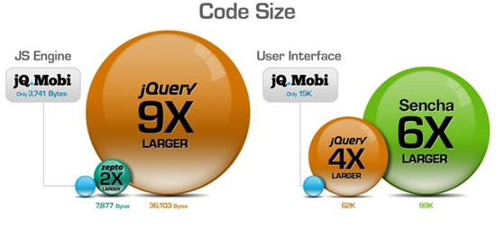
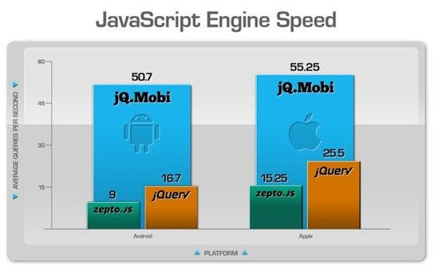
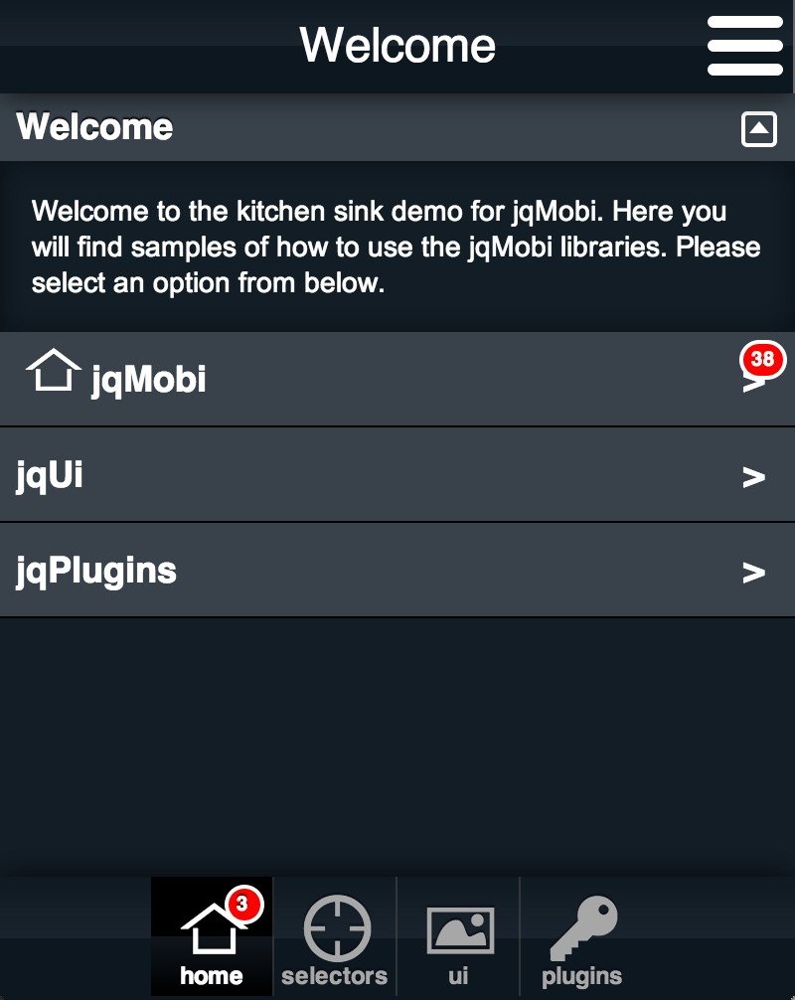
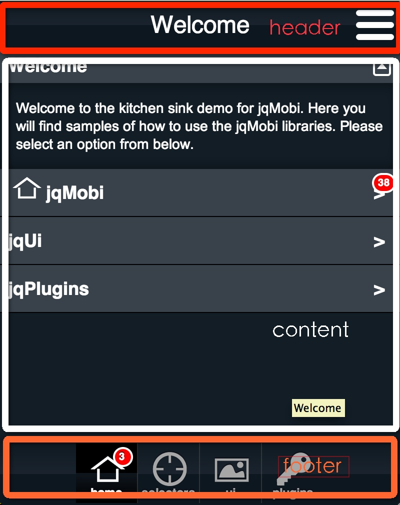
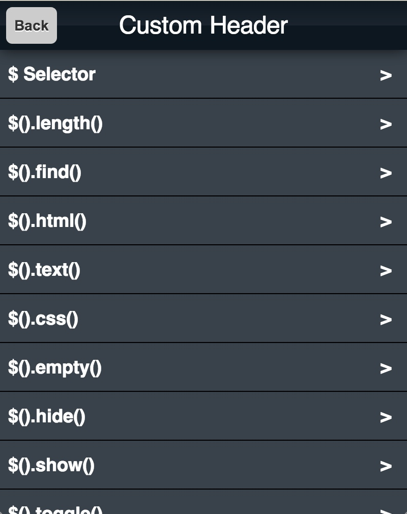
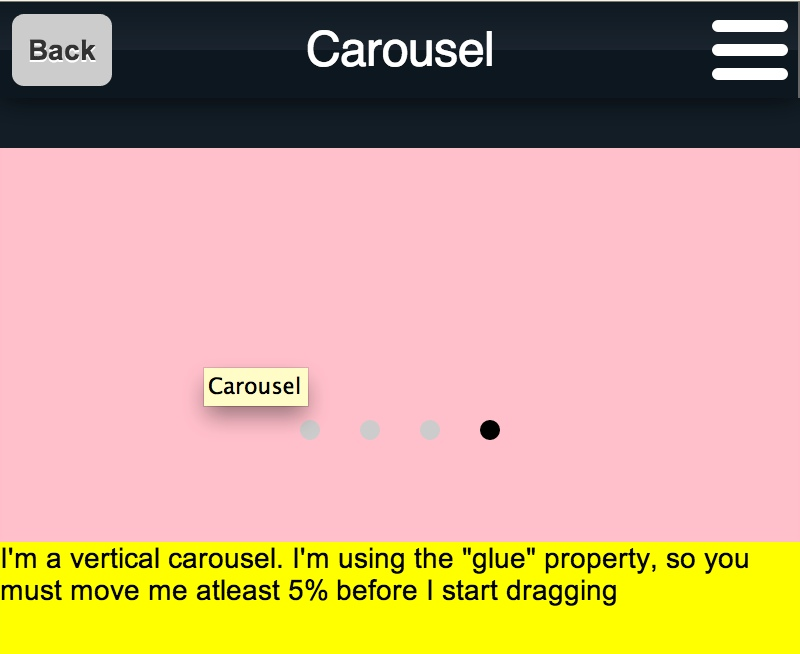
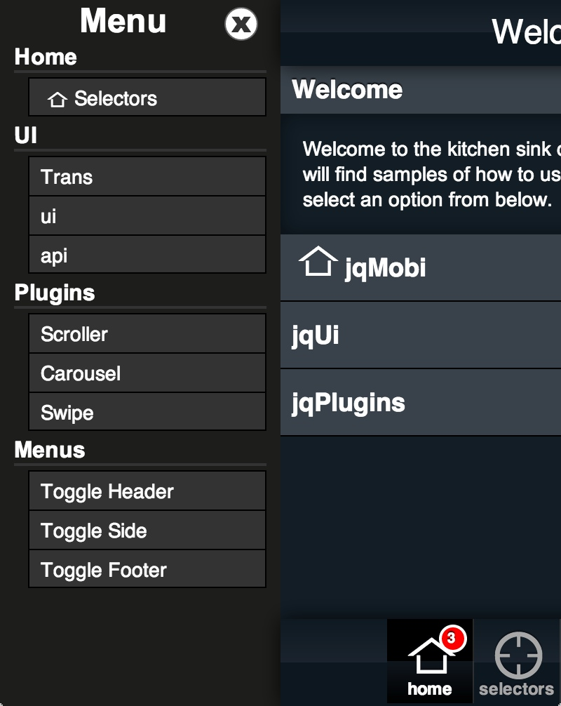

[jQ.Mobi](http://www.jqmobi.com/)是基于HTML5重写的jQuery框架，由appMobi开发并且开源托管于github，在此有简易的在线文档提供查阅。
jQ.Mobi相比于其他方案具有体积小速度快的优势。

jQ.Mobi由三个组件组成：
-	查询（query）程序库
-	jQ.ui——为webkit内核浏览器提供的用户界面程序库
-	jQ.Plugin——针对webkit浏览器的插件支持

下面主要讲解下框架的UI部分。

##1.基本页面布局

上图即为jQ.mobi提供的基本布局，从视觉上分为三个部分**头部、内容区域、底部**，如下图。

依照苹果App界面设计规则：
-	header头部属于**导航栏固定于整个应用的顶部**，主要是“你在这里”的标志（也可承载按钮）。
-	content内容区则用于**承载应用的不同页面**。
-	footer底部区则属于**标签栏固定于整个应用的底部**，用户可以通过点击不同的标签到达不同的页面。

应用的导航栏和标签栏，通常都是固定页面的顶部和底部，对于web app的布局中由于ios浏览器对于CSS的position:fixed支持很不好，因此**通用的解决方案（包括jQ.mobi)都是使用绝对定位position:absolute。**

对于jQ.mobi框架来说对应三部分的HTML代码为:

  

    

    

      

      

    

    

  

##2.jQ.Mobi中四种导航模型及其基本的HTML结构

苹果app定义了三种典型的导航模式再加上现在广为使用的“抽屉式”导航，四种导航模型在App设计中大量使用也覆盖了大部分应用的需求。

###2.1 标签栏导航模型

上面的图示则是典型的标签栏导航，也是目前最为欢迎的导航模型。

标签栏固定于应用的底部，点击其中不同的标签即可在不同的页面中切换，这种导航方式**适用于不同页面形式不一的复杂的应用。**
在jQ.Mobi中对应的HMTL代码为：

	

  	
    
    
    
    
	

受限于手机屏幕分辨率，标签栏中标签最好不要超过5个，如果标签数量超过5个，每个标签宽度过小，很可发生标签不易点中的问题，影响体验。
而如果页面归类超过5个，建议的处理方案是**将最后一个标签作为扩展标签设为更多。**

需要提示的是在jQ.Mobi框架中应用的所有页面都在一个HTML文档中，因此标签栏导航模式中页面切换实际上属于锚点切换，其不同页面的基本HTML代码为：

	

		

		

		

          …
	

**不同的页面包含在不同的class为panel的`div`中。**

###2.2 树形结构导航模型

上图即为典型的树形结构导航模型，树形结构适用于有大量分类项目的页面，其实际为大量的列表项。对应的HTML代码为：

     <ul>
          <li> </li>
          <li> </li>
          <li> </li>
          …
     </ul>

###2.3 平铺页面导航模型

上图即为平铺页面导航模型的基本结构，平铺页面导航模型的应用中最为经典的例子便是iphone中自带的天气应用，通常**此种模型使用较为简单的应用，功能较为单一且没有滚屏。**

在jQ.Mobi框架中可以使carousel插件实现，其HTML代码也较为简单：

     

          
 

          
 

          
 

          …
     

2.4 “抽屉式”导航模型

上图为“抽屉式”导航模型的基本结构，抽屉式导航最为典型的应用为私密社交应用path，此种导航的核心思想为”隐藏“，更加能突出应用的核型功能，而将其他次要的功能页面（譬如设置页面）路径隐藏。**此种导航模型使用核心功能单一，不户无需频繁切换页面的应用。**
在jQ.Mobi框架中使用此类导航也十分的方面，其HTML代码为：

     

          

          

               

               

               …
          

          

          

     

而对于实际的应用可以看出大多数的应用并不是使用单一的导航模型，而是各种导航模型混用，至于**选择那种导航模型作为主导航，则需根据应用的功能，使用场景以及用户群体等因素综合考虑。**

##3.jQ.Mobi框架布局细节

###3.1框架基本布局

之前提到过jQ.Mobi框架的页面都在一个HTML的文档中，除去导航栏（#header）和标签栏（#navbar）之外的内容页面都存在id为content的`div`当中，三者都是绝对定位。
其HTML和对应的CSS为：

	<!---HTML code--->
	

     

     

     

	

	/*---CSS code---*/
	#header {
     height : 48px;
	}

	#content {
     position:absolute;
     top:48px;
     bottom:62px;
     left:0;
     right:0;
     z-index:180;
	}

	#navbar {
     position:absolute;
     bottom:0;
     left:0;
     right:0;
     height:62px;
     z-index:1000;
	}

上面的即是框架最基本的布局方式，#header，#navbar固定在屏幕的上下边，相应#content的盒子占据了其他区域。值得注意的是#navbar的z-index远高于#content的z-index。

###3.2框架页面切换

框架的切换页面都包裹在class为panel的`div`中。

	

     

     

     

	

	

     <a href="#page1">XXX</a>
     <a href="#page2">XXX</a>
     <a href="#page3">XXX</a>
	

	/*---panel style---*/

	.panel {
     display:none;
     position:absolute;
     width:100%;
     height:100%;
     top:0;
     left:0;
     z-index:180;
	}

切换页面都在同一个HTML文档中，**使用锚链接跳转，跳转的同时需要显示页面的display属性设为block，同时需要隐藏的页面加一个向左移动的动画，加之panel页面使用绝对定位，宽度高度均铺满content，这样的跳转就达到了native应用页面切换的效果。**

而在页面切换时，另外的动作就是将
